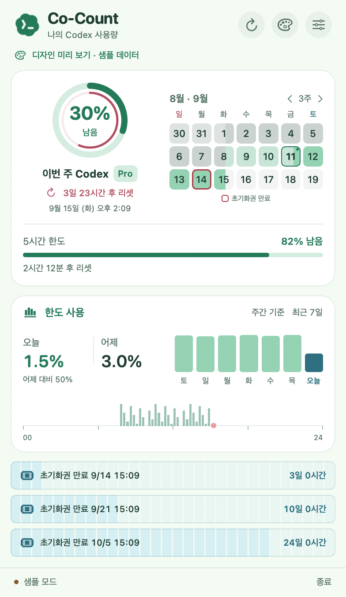

# Co-Count

나만을 위한 작은 macOS Codex 사용량 카운터. SwiftUI와 AppKit으로 만들었으며, 외부 패키지 의존성이 없습니다.



## 시작하기

macOS 14 이상, Swift 6 이상이 포함된 Xcode 또는 Command Line Tools, ChatGPT 계정으로 로그인한 Codex CLI가 필요합니다.

```bash
make run
```

`dist/Co-Count.app`을 빌드하고 실행합니다. 메뉴 막대의 게이지와 숫자를 클릭하면 패널이 열립니다. 숫자는 **기본 Codex 한도의 남은 비율**이며, 주간 한도가 있으면 우선 표시합니다. Dock 아이콘은 만들지 않습니다.

로그인이 필요하다는 안내가 나오면 터미널에서 `codex login` 후 앱을 새로고침하세요. Codex 앱과 CLI가 서로 다른 계정으로 로그인되어 있다면 **앱이 찾은 CLI의 계정**을 표시합니다.

생성한 앱을 Finder에서 `~/Applications`로 복사해 개인 앱으로 사용할 수 있습니다. 자동 실행 등록이나 기존 앱 변경은 하지 않습니다.

## 기본 기능

- 메뉴 막대에 남은 사용 한도 표시
- 메뉴 막대를 누르는 즉시 패널 표시, 짧은 페이드로 열기·닫기, 연속 클릭 전환 및 macOS 동작 줄이기 지원
- 바깥 한도 게이지 + 안쪽 따뜻한 색상의 시간 링, 리셋 일시·카운트다운
- 3주 달력: 지난 시간·남은 시간, 시작·종료일, 초기화권 만료 테두리
- 달력 안에서 현재 기간과 실제 기록된 과거 두 기간을 색상으로 구분
- 개별 초기화권의 만료 일시·남은 시간·잔여 기간 막대 (별도 제목·총수·외곽 카드 없음)
- 서버가 별도 한도를 제공할 때 두 번째 진행 막대 표시
- 오늘의 로컬 추정 토큰 및 어제 대비 비율, 어제 서버 집계와 최근 7일 서버 그래프
- 기존 토큰 카드와 같은 배치로 한도 사용률(%) 전환, 일별·시간별 잔여율 감소 기록
- 수동 갱신, 1·5·15분 자동 갱신, 잠자기 복귀 후 갱신
- 사용량 카드 표시·토큰/한도 전환 설정, 시스템·라이트·다크 모드
- 세이지·라벤더·스카이·피치·로즈 파스텔 프리셋, 상단에서 즉시 전환·자동 저장
- 연결 중·로그인 필요·갱신 실패 상태 및 샘플 데이터 모드

기본 갱신 간격은 5분입니다. 패널을 열 때 데이터가 1분 이상 지났으면 갱신합니다. 네트워크 실패 시 마지막 성공 값을 유지하며 `이전 데이터`로 표시합니다. 새로 실행했을 때는 캐시 없이 실제 데이터를 요청합니다.

## 색상 프리셋

상단 팔레트 아이콘 또는 **설정 → 컬러 프리셋**에서 5가지 색상을 고를 수 있습니다. 선택은 바로 적용되고 재실행 후에도 유지됩니다. 기본값은 세이지이며, 각 프리셋은 라이트·다크 모드를 지원합니다.

기존 색상 배치를 유지하면서 넓은 바탕 60 · 파스텔 보조 영역 30 · 핵심 강조 10을 기준으로 조정했습니다. [팔레트 출처·적용값·전체 비교](docs/color-palettes.md)를 참고하세요.

## 화면 수정하기

기본 패널 너비는 392pt로, 기존 560pt에서 30% 줄였습니다. 게이지와 리셋 정보를 세로로 묶어 달력 옆에 배치하고, 카드 여백·글씨·그래프 간격·설정 및 컬러 선택기도 좁은 폭에 맞췄습니다.

기존 Co-Count를 종료한 뒤 다음 명령으로 샘플 창을 열 수 있습니다.

```bash
make demo
```

또는 앱의 설정에서 `샘플 데이터로 미리 보기`를 켜세요. 샘플은 화면과 메뉴 막대에 명시적으로 표시되며, 재실행 시 실제 모드로 돌아갑니다. 샘플 모드는 네트워크를 요청하지 않습니다.

| 바꾸고 싶은 것 | 파일 |
| --- | --- |
| 의미별 색상, 카드 모서리, 패널 너비 | `Sources/Cocount/Design/Theme.swift` |
| 프리셋별 라이트·다크 색상 | `Sources/Cocount/Design/ThemePreset.swift` |
| 공통 색상 선택기 | `Sources/Cocount/Views/ThemePicker.swift` |
| 전체 레이아웃, 헤더, 푸터 | `Sources/Cocount/Views/DashboardView.swift` |
| 게이지, 한도 표시 | `Sources/Cocount/Views/QuotaCard.swift` |
| 3주 달력과 기간 이동 | `Sources/Cocount/Views/PeriodCalendarView.swift` |
| 초기화권 목록과 만료 표시 | `Sources/Cocount/Views/ResetCreditsView.swift` |
| 기간 기록·날짜 계산 | `Sources/CocountCore/UsagePeriod.swift` |
| 토큰 요약과 그래프 | `Sources/Cocount/Views/TokenCard.swift` |
| 한도 사용률 요약과 그래프 | `Sources/Cocount/Views/LimitUsageCard.swift` |
| 한도 잔여율 기록·일별·시간별 집계 | `Sources/CocountCore/LimitUsageHistory.swift` |
| 설정 항목 | `Sources/Cocount/Views/SettingsView.swift` |
| 백그라운드 이력 저장·계정별 캐시 | `Sources/CocountCore/UsageHistoryPersistence.swift` |
| 갱신 주기, 로딩·오류·샘플 상태 | `Sources/Cocount/UsageStore.swift` |
| 실제 데이터 연결 | `Sources/CocountCore/UsageProvider.swift` |
| 데이터 모델, 단위·날짜 표시 | `Sources/CocountCore/UsageModels.swift` |
| 메뉴 막대, 앱 수명주기 | `Sources/Cocount/App/CocountApp.swift` |
| 메뉴 패널 표시·닫기 애니메이션 | `Sources/Cocount/App/MenuBarPopover.swift` |

`Package.swift`를 Xcode에서 열거나 원하는 에디터에서 수정할 수 있습니다.

테스트는 실제 Core 소스와 검증 코드를 함께 컴파일하는 독립 실행형 Swift 체크입니다. `make test`는 XCTest나 전체 Xcode 설치 없이 Command Line Tools만으로 실행됩니다.

```bash
make build     # 개발 빌드
make test      # 데이터 해석 / 프로세스 통신 / 갱신 스케줄 검증
make benchmark # 합성 로그·대량 기록으로 성능 측정
make benchmark-history # 오늘 기록/과거 요약의 실제 저장량 비교
make disk-usage # 프로젝트·빌드·앱 용량 확인
make clean-cache # 재생성 가능한 컴파일러 캐시·IDE 인덱스 정리
make app       # 로컬 서명한 dist/Co-Count.app 생성
make preview   # docs/images에 샘플 화면 PNG 생성
swift run Co-Count --probe  # 실제 연결 확인: 한도 요약만 터미널 출력
swift run Co-Count --window # 같은 화면을 독립 창으로 열어 개발
```

## 데이터 연결

```text
SwiftUI 화면 → UsageStore → UsageProvider
                              ├─ AppServerUsageProvider → Codex CLI → Codex 서비스
                              └─ 샘플 데이터 (네트워크 없음)
```

Codex의 공식 app-server JSON-RPC 인터페이스를 사용합니다. 한 번의 갱신마다 로컬 CLI 프로세스를 열어 초기화하고 `account/read`, `account/rateLimits/read`, 선택적으로 `account/usage/read`를 요청한 뒤 닫습니다. 조회는 메인 스레드 밖에서 실행하고, 전체 연결에는 20초 제한을 적용합니다. 앱 종료 시 진행 중인 조회도 취소합니다.

앱 자체는 인증 파일이나 브라우저 쿠키를 읽거나 복사하지 않습니다. 로그인과 인증 갱신은 설치된 Codex CLI가 처리합니다. 모델 실행이나 대화 생성 요청은 없습니다. 앱에 별도 분석·추적 서비스는 없으며, 실행한 app-server의 분석 전송도 꺼 둡니다.

실행 파일은 `COCOUNT_CODEX_PATH`, `PATH`, 일반 CLI 설치 위치, Codex/ChatGPT 앱 번들 순으로 찾습니다. 커스텀 설치라면 다음처럼 절대 경로를 지정하세요.

```bash
COCOUNT_CODEX_PATH="/absolute/path/to/codex" swift run Co-Count
```

Finder로 실행한 앱에는 터미널 환경 변수가 전달되지 않을 수 있습니다. 기본 설치 위치를 사용하거나 위 명령으로 실행하세요. `CODEX_HOME`이 설정되어 있으면 Codex CLI가 해당 설정을 따릅니다.

## 수치의 의미와 기본 범위

- **구독 한도 비율과 토큰 수는 별도 지표입니다.** 토큰 수에서 구독 비율이나 비용을 역산하지 않습니다.
- 다중 한도 응답에서는 `codex`를 선택합니다. Spark 등 다른 모델 한도를 기본 Codex 한도로 대체하지 않습니다.
- 주간 한도가 `primary`에 올 수도 있습니다. 배열 위치 대신 `windowDurationMins`로 기간을 판단합니다.
- 어제 토큰과 7일 그래프는 **서버 일별 집계**이며 지연될 수 있습니다. 오늘 숫자에만 **이 Mac의 로컬 추정치**를 표시합니다. 서버 미집계는 `—`로 표시하고, 로컬 기록을 정상 조회했지만 오늘 활동이 없으면 추정 0입니다.
- 일별 날짜는 서버가 준 `startDate`를 유지합니다. 화면의 오늘·어제는 Mac의 달력 날짜와 비교합니다. 서버 집계의 시간대가 로컬과 같다는 보장은 없습니다. 집계 기준 안내는 토큰 카드의 도움말에서 확인할 수 있습니다.
- 토큰 조회가 지원되지 않거나 실패해도 한도 게이지는 계속 동작합니다. CLI 프로토콜 변경 시 Core 계층을 수정할 수 있습니다.
- 비용 추정, 초기화권 사용, 다중 계정 관리, 알림, 로그인 시 실행, 떠 있는 위젯은 포함하지 않았습니다. 스파크 모델 표시·카운트도 없습니다.

참고 조사와 구조 결정은 [docs/references.md](docs/references.md)에 정리했습니다. 외부 앱의 코드·아이콘·이미지를 복사하지 않고 새로 작성했습니다.

## 시간 링·달력·초기화권

- 바깥 강조색 원은 **남은 사용 한도**, 안쪽 시간 링은 **전체 한도 기간 중 남은 시간**입니다. 시작 시각은 서버 리셋 시각에서 한도 기간을 뺀 값으로 계산합니다.
- 달력은 일요일부터 3주를 표시합니다. 현재 기간의 경과 시간과 남은 시간은 선택한 프리셋의 파스텔을 서로 다른 농도로 표시합니다. 직전 기간과 두 번째 과거 기간은 서로 다른 농도의 회색으로 표시합니다. 오늘은 작은 점, 초기화권 만료일은 빨간 테두리로 표시합니다. 하루 중간에 시작·종료하면 날짜 칸을 시간 비율로 나눠 칠합니다.
- 별도의 기간 카드 없이 달력에서 기간을 확인합니다. 좌우 화살표는 한 주씩 이동하며 `3주`를 누르면 오늘로 돌아옵니다. 날짜에 마우스를 올리면 현재/과거 기간 구분과 시작·종료 시각이 표시됩니다. 초기화권 행을 누르면 그 만료일로 이동합니다.
- 과거 기간은 서버가 과거 이력을 반환하지 않으므로 **앱이 처음 확인한 기간부터** 기록합니다. 최대 세 기간(현재 + 과거 두 개)을 UserDefaults에 저장하고, 로그인 이메일·플랜·Codex 홈의 해시로 구분합니다. 이메일 원문이나 토큰은 저장하지 않습니다. 첫 실행에는 확인하지 못한 과거 날짜를 채우지 않으며 샘플 모드에서만 예시 세 기간을 제공합니다.
- 초기화권 수는 서버의 `availableCount`를 기준으로 합니다. 상세 목록이 생략되거나 일부만 반환되어도 보유 수를 목록 길이로 바꾸지 않습니다. 만료일이 없는 권은 `만료 없음`, 만료 시각이 지난 응답은 `만료 · 갱신 필요`로 표시합니다.
- 본문이 화면 높이를 넘으면 스크롤할 수 있습니다. 초기화권이 네 장 이상이면 카드 안에서도 목록을 스크롤할 수 있습니다.

초기화권 행은 높이 32pt의 한 줄 표시입니다 (`초기화권 만료 9/21 09:00`). 배경 한 칸은 24시간이며, 선택한 프리셋의 보조색은 남은 시간을 나타냅니다. 하루 미만의 잔여 시간은 블록 일부만 채웁니다.

## 한도 사용 카드

기존 토큰 카드의 크기, 오늘·어제 배치, 최근 7일 막대, 하단 시간대 그래프를 유지하면서 수치만 한도 사용률(%)로 전환합니다. 기본 표시는 **한도 사용**입니다. 카드 제목을 누르거나 **설정 → 카드 기본 표시**에서 토큰/한도를 바꾸면 선택이 저장됩니다. 우측 **주간 기준**을 누르면 서버가 제공하는 다른 한도(예: 5시간)로 전환됩니다. 두 한도의 비율은 합치지 않습니다.

- 오늘·어제 수치: 선택한 한도 전체를 100%로 본 사용량. 잔여율 80% → 75%는 5% 사용입니다. `어제 대비`는 오늘 기록분 ÷ 어제 기록분 × 100입니다.
- 7일 그래프: 기존과 같이 마우스를 올리면 날짜·%가 표시됩니다. 날짜 막대를 누르면 하단 그래프가 해당일로 바뀝니다.
- 하단 그래프: 기존 15분 간격 모양을 유지하며, 마우스를 올리면 해당 **1시간의 사용률**과 관측 시간을 표시합니다. Mac 현지 날짜·시간 기준이며, DST가 있는 날도 실제 하루 길이를 따릅니다.
- 수치는 연속된 두 조회에서 같은 리셋 기간의 잔여율 감소분으로 계산합니다. 조회 사이 감소분을 시간 비례로 나누므로 일별·시간별 값은 추정입니다. 리셋 시각이 바뀌거나 잔여율이 증가한 구간, 30분 넘는 공백, 값 누락·만료 구간은 제외합니다. 관측이 빠진 경우 실제 사용보다 적을 수 있으며 도움말에 `일부 구간`으로 표시합니다.
- `—`는 기록 없음, `0.0%`는 관측된 구간의 사용 없음입니다. 처음에는 기준값만 저장하고 두 번째 정상 조회부터 집계합니다. 여러 리셋 기간의 사용량을 합하면 일별 값이 100%를 넘을 수 있습니다.
- **업데이트 후 앱이 관측한 시점부터 기록**하며 과거 토큰 수에서 사용률을 역산하지 않습니다. 오늘의 잔여율·리셋 시각·조회 시각은 상세 기록으로, 지난 1~8일은 15분 단위 사용률·관측 시간 요약으로 보관합니다. 오늘 기록은 최대 20,000개 관측점으로 제한하며 자정 연결을 위한 직전 기준점 하나를 함께 유지합니다. 동일한 한도·리셋 시각에서 잔여율 변화가 없는 연속 구간은 30분 범위 안에서 중간 관측점만 합쳐 저장하며, 구간의 시작·끝과 관측 시간은 유지합니다. 기존 계정·플랜·Codex 홈 해시로 분리하며 계정 식별 정보가 없으면 조회 간 기록을 연결하거나 영구 저장하지 않습니다. 샘플 데이터는 실제 기록에 저장하지 않습니다.
- 이력 파일은 `~/Library/Application Support/Co-Count/UsageHistory/v2`의 계정별 해시 폴더에 저장합니다. `today.json`만 평소 갱신하고, 지난 날짜의 바이너리 요약은 마감할 때 한 번 저장합니다. 기존 UserDefaults 이력은 자동 이전하며, 요약 검증과 오늘 파일 저장이 성공한 뒤 기존 키를 제거합니다. 저장에 실패하면 기존 파일과 메모리의 상세 기록을 유지하고 다음 조회에서 재시도합니다.
- 과거 요약은 사용률 합계와 실제 관측 시간을 보존하므로 기존 일별·시간별·15분별 그래프가 유지됩니다. 자정을 넘는 첫 조회로 전날 마지막 구간까지 계산한 뒤 마감하며, 종료·잠자기 중에는 다음 정상 조회 때 처리합니다. 날짜가 바뀌어도 앱이 별도 마감 타이머로 깨어나지는 않습니다. DST는 실제 하루 길이를 따르고, 시간대 변경 시 이미 마감된 절대 시간 구간을 새 달력 기준으로 배치합니다. 마감 후 과거의 1분 단위 원본 재분석은 지원하지 않습니다.
- 카드가 숨겨져 있거나 토큰 모드여도 정상 한도 조회마다 기록이 누적됩니다. 앱이 실행되지 않는 동안은 관측하지 않습니다.

## 오늘 추정 토큰

오늘 숫자만 `CODEX_HOME`(기본 `~/.codex`) 아래 `sessions`와 `archived_sessions`의 로컬 JSONL을 읽어 추정합니다. 어제 숫자와 7일 그래프는 기존 서버 집계를 유지합니다. 비교는 `오늘 로컬 추정 ÷ 어제 서버 토큰 × 100`입니다. 어제가 0이거나 어느 한쪽을 집계하지 못했으면 `어제 대비 —`로 표시합니다.

`token_count`의 누적 `total_token_usage.total_tokens` 증가분을 계산합니다. 첫 이벤트나 누적값 감소 시에는 `last_token_usage.total_tokens`를 사용해 상속된 누적값을 통째로 더하지 않습니다. 캐시 토큰은 입력 총수에 다시 더하지 않습니다. 같은 시각·총수·입출력 카운터의 복사된 이벤트는 중복 제거합니다. 로그 형식 변경이나 복잡한 분기·압축 기록에 따라 오차가 있을 수 있으며, 전체 계정의 정확한 청구 집계는 아닙니다.

오늘 수정된 파일을 대상으로 날짜가 오늘인 이벤트만 집계합니다. 파일 식별자·수정 시각·크기가 같은 파일은 메모리 캐시를 재사용합니다. 처음 보는 파일은 전체를 읽고, 기존 로그에 추가된 내용은 마지막 완성 줄 이후만 스트리밍으로 읽습니다. 파일 앞·뒤 경계 해시로 추가 여부를 확인하며 교체·축소·경계 변경 시 전체를 다시 읽습니다. 캐시에는 카운터·해시·읽기 위치만 보관하고 날짜·시간대가 바뀌면 초기화합니다. 읽는 중인 미완성 마지막 줄은 다음 갱신까지 기다립니다. 대화 본문을 저장하거나 업로드하지 않으며 캐시에도 숫자·이벤트 식별값만 유지합니다. 로컬 기록에 계정 식별자가 없어 같은 Codex 홈을 여러 계정이 사용했다면 합산될 수 있고, 다른 Mac·클라우드 기록은 포함되지 않을 수 있습니다. 날짜 기준은 Mac 현지 날짜이므로 어제 서버 집계와 범위·시간대가 다를 수 있습니다.

로컬 집계는 서버 요청과 별도로 갱신됩니다. 샘플 모드, 카드 숨김, 한도 카드 표시 중에는 로컬 집계와 서버 토큰 요약 조회를 시작하지 않습니다. 카드 전환·숨김 시 최근 토큰 결과와 메모리 캐시를 유지하며, 이미 시작한 조회는 완료해 재사용합니다. 토큰 카드는 처음 표시하거나 마지막 토큰 조회 시도에서 설정한 갱신 간격(기본 5분)이 지났을 때만 새로 조회합니다. 날짜·시간대 변경도 재조회하며, 한도만 갱신해도 토큰의 유효 시간이 늘어나지 않습니다. 다른 조회가 진행 중이면 완료 후 필요한 경우에만 한 번 추가 조회합니다. 토큰 조회 실패도 같은 간격 동안 재시도를 제한하지만 수동 새로고침은 즉시 동작합니다. 서버 토큰 결과는 같은 계정이 확인된 경우에만 유지하고, 샘플/실제 모드를 바꾸면 캐시를 초기화합니다. 오늘 추정 숫자 아래의 도움말에서 범위와 일부 기록 처리 여부를 확인할 수 있습니다.

```bash
swift run Co-Count --probe-local
```

## 성능과 저장 공간

2026-09-11 최적화에서 추가 로그 재읽기, 그래프 중복 집계, 반복 애니메이션의 레이아웃 갱신, 메인 스레드의 이력 직렬화를 줄였습니다. 이력은 활성 계정만 메모리에 유지하고 백그라운드에서 저장하며, 같은 기간 정보는 다시 쓰지 않습니다. 오늘 상세 기록과 지난 8일의 고정 요약을 분리해 과거 자료를 매번 다시 쓰지 않습니다. 날짜별 첫 정상 저장 시 보관 기한이 지난 다른 계정의 한도 기록도 정리합니다.

1차 캐시 정리에서 프로젝트 용량을 약 528MB에서 85MB로 줄였습니다. 일별 요약 기능과 검증 산출물을 포함한 현재 프로젝트는 약 92MB, 앱 번들은 약 2.5MB입니다. `make clean-cache`는 컴파일러 모듈 캐시와 IDE 인덱스만 지우며 다음 컴파일에서 다시 생길 수 있습니다. 배포 앱은 새 임시 폴더에서 만들고 검증 후 교체해 오래된 리소스가 남지 않게 합니다. 아이콘 소스가 같으면 기존 아이콘을 재사용하고 임시 파일은 종료 시 정리합니다.

측정 조건, 전후 수치, 데이터 증가량, 검증 범위는 [성능 점검 보고서](docs/performance.md)를 참고하세요.
