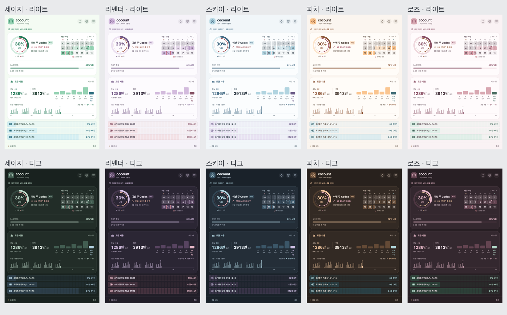

# Co-Count 파스텔 컬러 프리셋

2026-09-11. 기존 카드·게이지·달력·토큰 그래프·초기화권 위치를 유지하고 색상 역할을 공통 테마로 묶었습니다.



## 선택 방법

상단 팔레트 아이콘 또는 **설정 → 컬러 프리셋**에서 세이지, 라벤더, 스카이, 피치, 로즈를 선택합니다. 즉시 전체 화면에 적용되며 UserDefaults에 저장됩니다. 첫 실행과 알 수 없는 저장값의 기본값은 세이지입니다. 시스템·라이트·다크 화면 모드는 프리셋과 독립적으로 선택할 수 있습니다.

## 조사한 팔레트와 UI 적용값

외부 팔레트는 색상 조합의 출발점입니다. 아래 바탕·강조색·다크 모드·보조색은 작은 글자의 대비와 Co-Count 화면의 균형에 맞춰 별도로 조정했습니다. 원본 팔레트 전체를 그대로 적용한 것은 아닙니다.

| 프리셋 | 레퍼런스 | 원본 참고색 | 라이트 바탕 | 파스텔 주조색 | 강조색 |
| --- | --- | --- | --- | --- | --- |
| 세이지 (라이트) | [Color Hunt · 크림·민트](https://colorhunt.co/palette/d8efd395d2b355ad9bf1f8e8) | `#D8EFD3` `#95D2B3` `#55AD9B` `#F1F8E8` | `#F4FBF3` | `#95D2B3` | `#247A58` |
| 라벤더 | [Canva · Soft in Hue](https://www.canva.com/colors/color-palettes/soft-in-hue/) | `#D3BBDD` `#ECE3F0` `#F8C0C8` | `#F5F2F8` | `#D3BBDD` | `#705583` |
| 스카이 | [Canva · Mermaid Lagoon](https://www.canva.com/colors/color-palettes/mermaid-lagoon/) | `#B1D4E0` `#145DA0` | `#F1F6F9` | `#B1D4E0` | `#426A84` |
| 피치 | [Canva · Pastel Vibrance](https://www.canva.com/colors/color-palettes/pastel-vibrance/) | `#FAC590` `#ECCBC0` `#94C0D0` | `#FBF5EF` | `#FAC590` | `#8D5637` |
| 로즈 | [Canva · Rosettes and Cream](https://www.canva.com/colors/color-palettes/rosettes-and-cream/) | `#D8A7B1` `#FAE8E0` `#B6E2D3` | `#FAF2F4` | `#D8A7B1` | `#884E63` |

[Color Hunt의 파스텔 컬렉션](https://colorhunt.co/palettes/pastel)과 [Canva의 Pastel Dreams](https://www.canva.com/colors/color-palettes/pastel-dreams/)도 비교했습니다. 최종적으로 채도를 억제한 세이지·라벤더 계열, 밝은 블루, 따뜻한 살구·로즈를 골라 성격이 다른 5개 프리셋으로 구성했습니다.

### 세이지 라이트 보정

기존 회색빛 세이지가 탁해 보인다는 피드백을 반영해 라이트 팔레트만 크림·민트 계열로 교체했습니다. 원본 민트 `#95D2B3`를 주조색으로 사용하고, 바탕은 밝게 희석한 `#F4FBF3`, 카드는 순백, 강조색은 글자 대비를 위한 `#247A58`로 조정했습니다. 보조 블루와 시간 로즈도 회색기를 줄였습니다.

기존 배치와 6:3:1 기준, 세이지 다크와 다른 4개 프리셋은 유지합니다. 세이지 다크는 기존 [Light Sage & Pale Lavender](https://www.pastelcolorpalettes.com/light-sage-pale-lavender) 레퍼런스 기반입니다.

## 6:3:1 배치

고정된 픽셀 면적 비율이 아니라 기존 배치를 유지하기 위한 시각적 비중의 기준입니다. 데이터량·토큰 카드 표시·스크롤에 따라 실제 면적은 달라집니다.

- **60 — 바탕:** 아주 옅은 색을 입힌 캔버스와 거의 흰 카드로 넓은 영역을 차분하게 유지합니다. 다크 모드에서는 색조가 있는 짙은 바탕과 카드로 전환합니다.
- **30 — 보조 영역:** 로고 바탕, 달력 현재 기간, 지난 토큰 막대, 게이지 트랙, 초기화권의 일별 블록을 부드러운 파스텔로 묶습니다. 초기화권에는 조화를 이루는 두 번째 색조를 사용합니다.
- **10 — 강조:** 한도 숫자·게이지, 오늘 토큰, 현재 선택, 시간 링·카운트다운에 대비가 높은 색을 제한적으로 적용합니다.

카드 간격·너비·모서리·정보 순서는 유지했습니다. 경고와 10% 이하 한도, 만료일 테두리는 의미를 유지하는 별도의 위험색입니다. 시간 링은 프리셋에 어울리는 따뜻한 색조이며 위치·도움말로 한도 링과 구분합니다. 부분만 채워진 달력 날짜에도 같은 글자색을 사용해 경계에서 흰 글자가 사라지던 문제를 줄였습니다.

## 구현과 검증

- `Sources/Cocount/Design/ThemePreset.swift`: 5개 프리셋과 라이트·다크 팔레트.
- `Sources/Cocount/Design/Theme.swift`: 의미별 색상 토큰과 SwiftUI Environment 전달.
- `Sources/Cocount/Views/ThemePicker.swift`: 상단·설정에서 공유하는 선택기, 6:3:1 색상 견본, 선택 테두리·체크 표시와 접근성 값.
- `UsageStore.themePreset`: 반응형 전환과 저장·복원. 알 수 없는 값은 세이지로 처리.
- 시스템 화면 모드와 명시적인 라이트·다크 모드 모두 동일한 색상 환경으로 렌더링합니다. 네트워크 갱신 없이 색상을 바꿉니다.
- 릴리스 빌드 및 기존 Core 자동 검증 23개 통과.
- 5개 × 라이트·다크 = 10개 대시보드 렌더링을 비교 확인. 설정은 AppKit 컨트롤을 포함하므로 ImageRenderer 대신 실제 앱 화면에서 확인했습니다.
- sRGB 상대 휘도 계산으로 기본/보조 글자, 강조색, 시간 글자, 달력 숫자, 초기화권 글자의 해당 배경 대비를 검사했습니다. 검사한 90개 조합 모두 4.5:1 이상입니다. 전체 접근성 인증을 의미하지는 않습니다.
- 실제 앱에서 상단 5개 프리셋 전환, 설정에서 선택 동기화, 라이트·다크 모드 적용을 확인했습니다. 별도 샘플 앱을 종료하고 다시 실행해 라벤더 선택과 다크 모드가 복원되는 것도 확인했습니다.

개별 프리셋 렌더링:

```bash
make app
dist/Co-Count.app/Contents/MacOS/Co-Count --snapshot "$PWD/docs/images/themes/rose-light.png" --theme rose
dist/Co-Count.app/Contents/MacOS/Co-Count --snapshot "$PWD/docs/images/themes/rose-dark.png" --theme rose --dark
```

`--theme`은 스냅샷의 임시 설정에만 적용되며 실제 앱의 저장된 선택을 덮어쓰지 않습니다.
